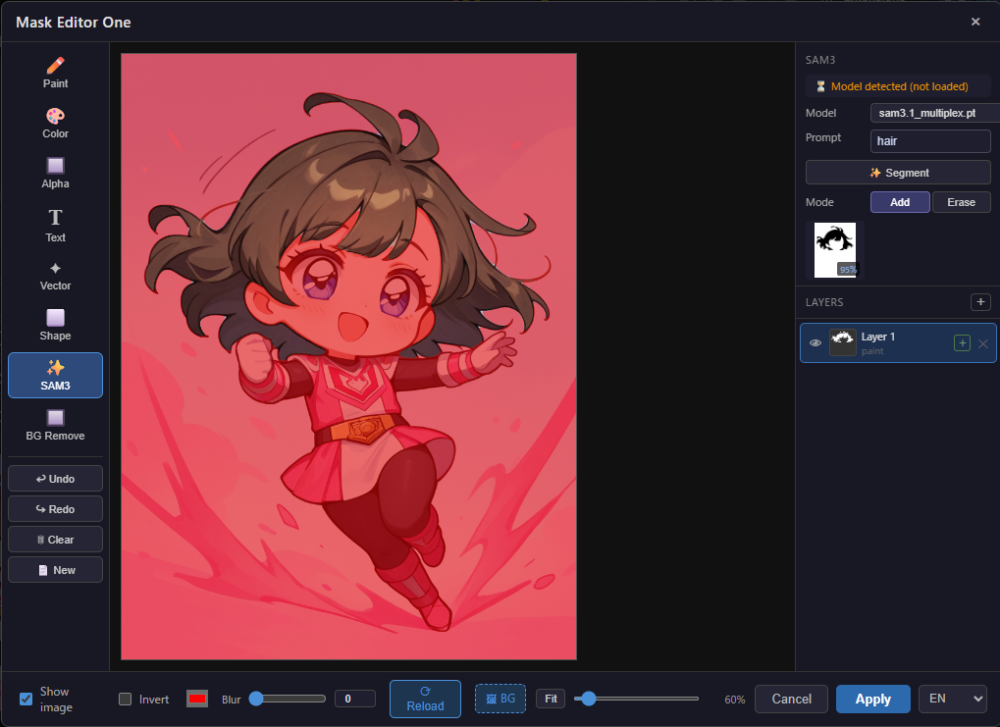
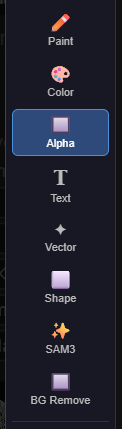
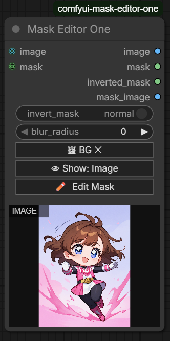
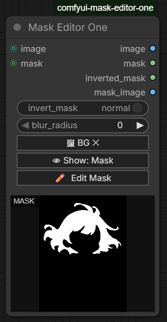
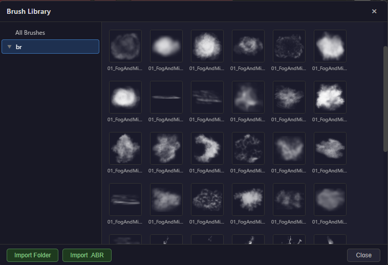

# Mask Editor One

[English](README_en.md) | **日本語** | [中文](README_zh.md)

ComfyUI 用のレイヤーベース・モーダルマスクエディタ。Photoshop ライクな操作感でマスクを作成・編集し、`IMAGE` と `MASK` を出力します。マスクに関する操作をこのノード一つで完結することを目的としています。



## 主な機能

- **モーダルエディタ** — ノード上の `Edit Mask` ボタンでブラウザ内エディタを起動
- **ペイントツール** — ブラシサイズ・硬さ・スペーシング・**角度**・add/erase モード。**サイズジッター**（Amount スライダーで縮小幅を調整）と**回転ジッター**（スタンプごとに 0°〜360° をランダム化）をチェックボックスで有効化
- **カラー選択ツール** — tolerance/feather 調整、add/subtract モード
- **透過抽出ツール** — アルファチャンネルからマスクを生成
- **テキストツール** — フォント・サイズ・Bold/Italic・アライメントを指定してテキスト形状のマスクを配置
- **ベクターツール** — Catmull-Rom スプラインでなめらかな閉じたパスを描いてマスク領域を生成
- **シェイプツール** — ドラッグで矩形・楕円を描画。Shift+ドラッグで中心点から正方形・正円を描画
- **SAM3ツール** — テキストプロンプトでAIセグメンテーション（SAM3 / SAM3.1）。モデル選択ドロップダウン付き、候補マスクをサムネイル表示、クリックで選択してレイヤーに適用
- **BiRefNet背景除去ツール** — ワンクリックで前景マスクを自動生成。ComfyUI ネイティブの BiRefNet 実装（`comfy.bg_removal_model`）を使用するため追加ライブラリ不要
- **全ツール共通 Mode 切り替え** — Add / Erase（または Add / Subtract）をボタンクリックで即切り替え
- **レイヤー管理** — 追加・削除・可視切替・add/subtract・ドラッグ並べ替え
- **Undo/Redo** — 各レイヤー 30 段
- **画像ブラシ** — グレースケール画像をブラシスタンプとして使用
- **ブラシライブラリ** — フォルダツリー UI、PNG フォルダインポート、`.abr` ファイルインポート
- **多言語対応（i18n）** — フッターの言語セレクターで英語・日本語・中国語を切り替え。設定は `localStorage` に保存され次回起動時も引き継がれる
- **マスク反転トグル** — ノード上のトグルとモーダルの Invert チェックが連動
- **Photoshop クイックマスク表示** — 画像表示時は全体に半透明オーバーレイを重ねて描いた部分を透過表示（Photoshop クイックマスクと同スタイル）。Invert 時は描いた部分にオーバーレイを表示。オーバーレイ色をカラーピッカーで変更可能
- **ブラーフィルター** — ノードウィジェットとモーダルのスライダーでガウスぼかしを調整（0〜200 px）、双方向連動
- **BG ドロップゾーン** — モーダルフッターのドロップゾーンにクリック（ファイル選択）または画像ファイルをドロップして背景を設定。キャンバスエリアへのドロップにも対応
- **New キャンバス** — ツールバーの `📄 New` ボタンで幅・高さを指定して新規の空キャンバスを作成。BG 読み込み・New どちらも実行後に新しいレイヤーを自動追加
- **ノードプレビュー** — 選択中の背景画像とApply後のマスクをノード上にプレビュー表示
- **IMG/MASK 切り替え** — ノード上のボタンで画像プレビュー ↔ マスクプレビューを切り替え
- **入力対応** — `IMAGE` / `MASK` 入力（どちらも未接続でも起動可能）
- **キャンバス外ドラッグ対応** — Shape/Paint 描画中にキャンバス端を越えてマウスが出ても描画継続（画像の端まで選択可能）

## インストール

ComfyUI の `custom_nodes/` 配下にこのフォルダを配置：

```
ComfyUI/
└── custom_nodes/
    └── comfyui-mask-editor/
        ├── __init__.py
        ├── nodes.py
        ├── server.py
        ├── abr_parser.py
        ├── sam3_inference.py
        ├── birefnet_inference.py
        ├── requirements.txt
        └── web/
```

依存パッケージ:

```bash
pip install -r requirements.txt
```

### SAM3 モデルのセットアップ（任意）

SAM3ツールを使う場合は、SAM3 チェックポイントを `ComfyUI/models/sam3/` に配置します。

```
ComfyUI/
└── models/
    └── sam3/
        ├── sam3.pt                              # SAM3（推奨）
        ├── sam3.safetensors                     # SAM3 safetensors 形式
        ├── sam3.1_multiplex.pt                  # SAM3.1
        └── sam3.1_multiplex_fp16.safetensors    # SAM3.1 FP16 safetensors
```

- `.pt` / `.pth` / `.safetensors` いずれも対応。複数配置した場合はドロップダウンで選択可能
- TorchScript/JIT 形式（`torch.jit.save` で保存）のファイルは自動的にスキップされます
- ファイル名に `sam3` を含まないファイルはリストに表示されません
- チェックポイントが見つからない場合は HuggingFace（facebook/sam3）から自動ダウンロードを試みます

### BiRefNet モデルのセットアップ（任意）

BiRefNet背景除去ツールを使う場合は、BiRefNet モデルを `ComfyUI/models/background_removal/` に配置します。

```
ComfyUI/
└── models/
    └── background_removal/
        └── birefnet.safetensors    # または BiRefNet.safetensors / BiRefNet-general.safetensors
```

- モデルは HuggingFace の `zhengpeng7/BiRefNet` からダウンロードできます
- ComfyUI が標準サポートする `comfy.bg_removal_model` を使用するため、追加ライブラリのインストールは不要です
- ファイルが見つからない場合はツールパネルにエラーが表示されます。推論を実行するまでモデルはメモリにロードされません

ComfyUI を再起動すると、ノードメニューの `image/masking` カテゴリに **Mask Editor One** が追加されます。

## 使い方

### 基本



1. `Mask Editor One` ノードをワークフローに追加
2. （任意）`IMAGE` / `MASK` 入力を接続
3. ノードの `Edit Mask` ボタンをクリック → モーダルエディタが開く
4. 左サイドバーからツールを選んでマスクを描画
5. `Apply` で結果を確定 → ノードを実行すれば `image` / `mask` 出力に反映

### ノードオプション

| 入力 | 説明 |
|------|------|
| `invert_mask` | 出力マスクを反転（黒↔白）。モーダルの Invert チェックと双方向に連動 |
| `blur_radius` | 出力マスクにかけるガウスぼかし半径（0〜200 px）。モーダルのスライダーと双方向に連動 |
| `image` | 入力画像（任意）。接続時は BG ボタン選択画像より優先 |
| `mask` | 入力マスク（任意） |
| `layer_data` | エディタの状態 JSON（通常は自動更新） |

### ノード上の BG ボタン

| 操作 | 動作 |
|------|------|
| `🖼 BG` クリック | ファイル選択ダイアログを開く。選択後 `🖼 BG ✕` に変わる |
| `🖼 BG ✕` クリック | 選択した BG 画像をクリア |
| `👁 表示: 画像` クリック | ノードプレビューをマスク表示に切り替え |
| `👁 表示: マスク` クリック | ノードプレビューを画像表示に切り替え |

- `image` 入力に接続がある場合は接続画像が優先。接続を切ると BG ボタンで選択した画像が使われる
- Apply するとマスクプレビューに自動切り替わり、ノード上に白黒マスクが表示される
- モーダルを**開いたまま** BG を変更するにはモーダルフッターの `🖼 BG` ボタンを使用

<p>
  
  
</p>

### テキストツール

1. ツールバーの **T (Text)** を選択
2. 右パネルでテキスト・フォント・サイズ・太字/斜体・アライメント・モードを設定
3. キャンバス上をクリック → テキスト入力オーバーレイが表示
4. テキストを入力して **Stamp** または `Ctrl+Enter` で確定、`Esc` でキャンセル

| オプション | 説明 |
|---|---|
| Text | スタンプするテキスト（改行で複数行対応） |
| Font | フォントファミリー（Arial, Georgia, Impact など 11 種） |
| Size | フォントサイズ（8 〜 400 px） |
| Style | **B** (Bold) / *I* (Italic) |
| Align | Left / Center / Right |
| Mode | **Add** / **Erase** ボタンをクリックで切り替え |

### ベクターツール

1. ツールバーの **✦ (Vector)** を選択
2. キャンバスをクリックしてアンカーポイントを追加（黄色の点）
3. マウス移動でパスのプレビューをリアルタイム確認
4. **閉じたパス**: 最初のポイント（赤くハイライト）をクリックで閉じて塗りつぶし確定
5. **開いたパス**: `Enter` で確定（Undo 可）

| ショートカット | 動作 |
|---|---|
| クリック | アンカーポイントを追加 |
| 最初の点をクリック | パスを閉じて確定 |
| `Enter` | 開いたパスで確定 |
| `Backspace` / `Delete` | 最後のアンカーポイントを削除 |
| `Esc` | パスをリセット |

スプラインは **Catmull-Rom → Bézier 変換** で描画されるため、全アンカーを通る滑らかな曲線が自動生成されます。

### シェイプツール

1. ツールバーの **⬜ (Shape)** を選択
2. 右パネルで形状（Rectangle / Ellipse）とモード（Add / Erase）を選択
3. キャンバスをドラッグして描画

| 操作 | 動作 |
|---|---|
| ドラッグ | 開始点 → 終了点を対角とする矩形・楕円を描画 |
| `Shift` + ドラッグ | **開始点を中心**とした正方形・正円を描画 |

ドラッグ中は青い点線でリアルタイムプレビューが表示されます。

### SAM3ツール

1. ツールバーの **✨ (SAM3)** を選択
2. 右パネルの **Model** ドロップダウンで使用するチェックポイントを選択（`models/sam3/` にある有効なファイルが一覧表示。1つのみの場合は非表示）
3. プロンプトを入力して **Segment** または `Enter` で推論を実行
4. 候補マスクのサムネイルがスコア順に表示される
5. サムネイルをクリックでアクティブレイヤーに適用

| オプション | 説明 |
|---|---|
| Model | 使用するチェックポイントファイル名 |
| プロンプト | セグメント対象を英語で指定（例: "dog", "red ball"） |
| Mode | Add（白で描画）/ Erase（マスクを消去） |

### BiRefNet背景除去ツール

1. ツールバーの **🔲 (BG Remove)** を選択
2. 右パネルのステータスを確認（モデルが配置済みなら "Model found" と表示）
3. **Remove BG** ボタンをクリック → BiRefNet が前景マスクを自動生成してアクティブレイヤーに適用
4. **Mode** で結果の適用方法を選択

| オプション | 説明 |
|---|---|
| Mode | Add（前景を白でマスク追加）/ Erase（前景領域のマスクを消去） |

- モデルが初回ロード時（約1〜3秒）はボタンが無効化されスピナーが表示されます
- 推論中もボタンは無効化されます。完了後にレイヤーへ自動適用されます
- エラーが発生した場合はパネルにエラーメッセージが表示されます

### ペイントツール

ブラシ描画は Photoshop 互換の動作：

- **Hardness** — 不透明な中心コアの半径を制御。`100%` でシャープエッジ、`0%` で全体がソフト
- **Spacing** — スタンプ間隔（ブラシサイズに対する割合）
- **Angle** — 画像ブラシの回転角度
- **Size Jitter** — チェックで有効化。スタンプごとにブラシサイズをランダムに縮小。**Amount** スライダー（0〜100%）で最大縮小幅を指定（50% の場合 50%〜100% の範囲）
- **Rotation Jitter** — チェックで有効化。スタンプごとに 0°〜360° の回転をランダム化。画像ブラシで特に効果的
- **アスペクト比保持** — 画像ブラシのスタンプは元画像の縦横比を維持（`brushSize` は高さ基準、幅は自動計算）
- **ストローク内累積なし** — 1ストローク中に重なった箇所は `lighten` で最大値を取り、同一ストロークでの過剰な濃度積み上がりを防ぐ

### ブラシライブラリ

ペイントツール選択時に `Browse Brushes…` ボタンからブラシライブラリを開けます。



- **Import Folder** — PNG/JPG/WebP/BMP を含むフォルダを再帰的に取り込み
- **Import .ABR** — Photoshop の `.abr` ブラシファイルを取り込み（後述）

ブラシは `custom_nodes/comfyui-mask-editor/brushes/` 配下に保存されます。  
サムネイルは黒背景に白いブラシシェイプで表示されます（Photoshop のブラシプレビューと同形式）。

### ABR ブラシのインポート

対応バージョン:

| バージョン | 対応状況 |
|------------|----------|
| ABR v1 (Photoshop 5) | ✅ |
| ABR v2 non-sub6 (Photoshop 5.5–7, block-length format) | ✅ Unicode ブラシ名対応 |
| ABR v2 sub6 / v6 (Photoshop 7+) | ✅ ActionDescriptor パース |
| ABR v6 UUID-keyed samp (Photoshop CC+) | ✅ canvas bounds 固定小数点パース |
| ABR v6 Atenais 形式 (05_Flames 等) | ✅ offset 320 の BE u16 行カウントテーブル + PackBits |
| ABR v10 | ✅ |

インポートされたブラシは **RGBA PNG** として保存されます：
- `RGB = (255, 255, 255)` 白固定
- `A = ブラシ密度`（明るいほど不透明 = 強くペイント）

> **既存ブラシの再インポートについて**  
> ABR 保存形式を変更した場合は、ブラシライブラリの該当フォルダを削除してから ABR を再インポートしてください。

## アーキテクチャ

```
comfyui-mask-editor/
├── nodes.py              # MaskEditorOne (process / layer合成)
├── server.py             # PromptServer API (image cache, brush, SAM3, BiRefNet endpoints)
├── abr_parser.py         # ABR ファイルパーサー
├── sam3_inference.py     # SAM3 推論バックエンド
├── birefnet_inference.py # BiRefNet 背景除去バックエンド
└── web/
    ├── css/maskEditor.css
    └── js/
        ├── maskEditor.js              # ComfyUI 拡張エントリ
        └── editor/
            ├── MaskEditorModal.js     # モーダル UI 全体
            ├── CanvasCompositor.js    # レイヤー合成
            ├── LayerManager.js        # レイヤー管理（Undo/Redo）
            ├── BrushLibrary.js        # ブラシライブラリ UI
            ├── i18n.js               # 翻訳辞書（en/ja/zh）
            └── tools/
                ├── BaseTool.js
                ├── PaintTool.js        # ペイントツール
                ├── ColorTool.js        # カラー選択
                ├── TransparencyTool.js # アルファ→マスク
                ├── TextTool.js         # テキスト形状マスク
                ├── VectorTool.js       # Catmull-Rom スプラインベクター
                ├── ShapeTool.js        # 矩形・楕円シェイプ
                ├── Sam3Tool.js         # SAM3.1 AIセグメンテーション
                └── BiRefNetTool.js     # BiRefNet 背景除去
```

### API エンドポイント

| メソッド | パス | 用途 |
|----------|------|------|
| POST | `/mask_editor/get_node_image` | ノード ID から画像/マスク取得 |
| POST | `/mask_editor/store_image` | ブラウザから画像をキャッシュ |
| POST | `/mask_editor/save_result` | レイヤーデータ保存 |
| GET | `/mask_editor/brushes/list` | ブラシフォルダツリー |
| GET | `/mask_editor/brushes/raw?path=…` | ブラシ画像配信 |
| POST | `/mask_editor/brushes/import` | PNG フォルダインポート |
| POST | `/mask_editor/brushes/upload_abr` | ABR ファイル取り込み |
| GET | `/mask_editor/sam3/status` | SAM3 ロード状態・利用可能モデル一覧（`models` 配列、ファイル名のみ） |
| POST | `/mask_editor/sam3/segment` | テキストプロンプトでセグメンテーション実行（`model` フィールドでチェックポイント指定可） |
| GET | `/mask_editor/birefnet/status` | BiRefNet ロード状態・モデルファイルの有無（`model_path` はファイル名のみ） |
| POST | `/mask_editor/birefnet/remove_bg` | BiRefNet で背景除去を実行し、前景マスク（data URL PNG）を返す |

## デバッグ

詳細ログを有効化:

```python
import logging
logging.getLogger("abr_parser").setLevel(logging.DEBUG)
logging.getLogger("server").setLevel(logging.DEBUG)
```

ブラシ取り込み問題の調査時は ComfyUI ターミナルのログを確認してください。

## ロードマップ

実装済み:
- Edit Mask モーダル、ペイント/カラー/透過ツール、レイヤー管理、Undo/Redo
- 画像ブラシ、ブラシライブラリ、ABR インポート (v1/v2/v6/v10)
- ブラシ角度、マスク反転トグル（モーダル Invert と連動）
- Photoshop 互換ブラシ描画エンジン（hardness、アスペクト比保持、ストローク内累積防止）
- BG ボタン（ローカル画像選択）、ノードプレビュー（画像/マスク切り替え）
- レイヤー可視アイコン常時表示（斜線でOFF状態を表示）
- モーダル Reload ボタン（入力画像を再取得）
- ABR v2 block-length format サポート（Unicode ブラシ名、Photoshop 5.5–7 形式）
- ABR v6 UUID-keyed samp オフセット修正（canvas bounds 固定小数点パース）
- **TextTool** — テキスト形状マスク（フォント/サイズ/Bold/Italic/アライメント、Ctrl+Enter で確定）
- **VectorTool** — Catmull-Rom スプラインベクターマスク（リアルタイムプレビュー、閉じたパス/開いたパス対応）
- **ShapeTool** — 矩形・楕円マスク（ドラッグ描画、Shift で中心点から正方形・正円）
- **Sam3Tool** — SAM3.1 AIセグメンテーション（テキストプロンプト → 候補マスク一覧、スコア表示、add/erase モード）
- **BiRefNet背景除去ツール** — ワンクリックで前景マスクを自動生成。`comfy.bg_removal_model` を使用（追加ライブラリ不要）、add/erase モード対応
- **ブラーフィルター** — `blur_radius` ノードウィジェット + モーダルスライダー（0〜200 px、Gaussian Blur、双方向連動）
- **IS_CHANGED** — BG ボタン画像変更時に ComfyUI キャッシュを自動無効化して再実行
- モーダル内 BG ボタン — モーダルを開いたまま背景画像を変更可能
- BG 変更時のモーダル自動リロード — ノード側 BG 変更がモーダルに即時反映
- **テキストツールの十字カーソル** — テキストツール選択時に画像上のカーソルを十字に変更して挿入位置を明確化
- **Photoshop クイックマスク表示** — `composite()` をアルファベースに変更し、`showImage=true` 時に全体オーバーレイ＋描画領域透過のクイックマスクスタイルでプレビュー表示
- **Invert 時のオーバーレイ** — Invert 時は描いた部分にオーバーレイ色を表示（ブラシ色として可視化）
- **オーバーレイカラーピッカー** — Invert チェック横のカラーピッカーでオーバーレイ色を変更可能
- **全ツール Mode ボタングループ化** — Mode 選択を `<select>` から Add/Erase ボタンクリックに変更
- **ノード名変更** — `MaskEditorNode` → `MaskEditorOne`、表示名 `"Mask Editor"` → `"Mask Editor One"`
- **セキュリティ強化** — リクエストサイズ上限（100 MB）・パストラバーサル修正・エラー情報漏洩防止・torch.load 安全化・ABR サイズ制限（4096 px / 500 件）
- **ABR v6 Atenais フォーマット対応** — 254 バイト固定プリアンブルを持つ Atenais 製 ABR（05_Flames.abr 等）の循環シフトバグを修正（table_off=320 の BE u16 行カウントテーブル形式）
- **ブラシジッター** — Size Jitter（Amount スライダーで縮小幅調整）と Rotation Jitter（0°〜360° ランダム回転）をチェックボックスで独立して有効化
- **i18n 多言語対応** — `i18n.js` モジュールで en/ja/zh の翻訳辞書を管理。フッターの言語セレクターで切り替え時は DOM を再構築してレイヤー状態を保持したまま全 UI テキストを更新。設定は `localStorage` に永続化


## ライセンス

未指定（個人利用前提）。
